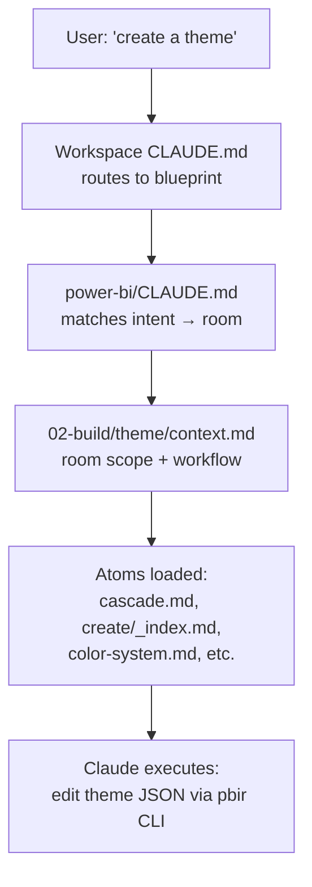
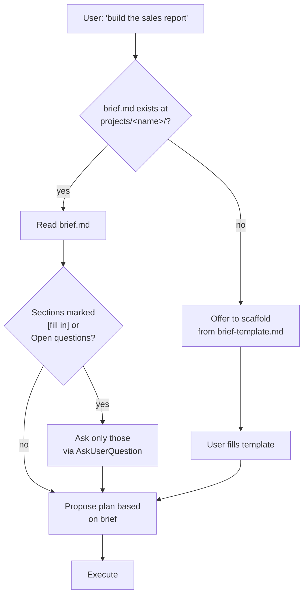
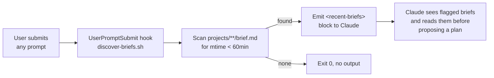
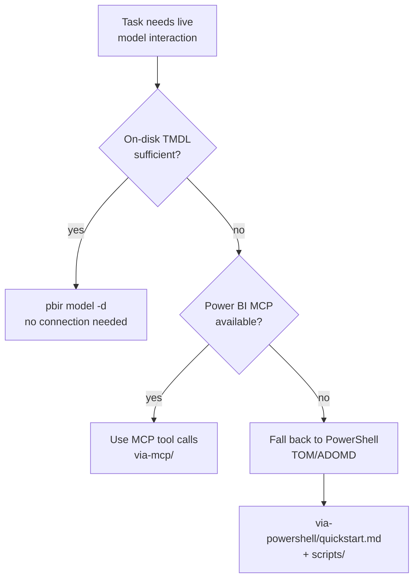
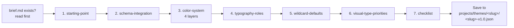
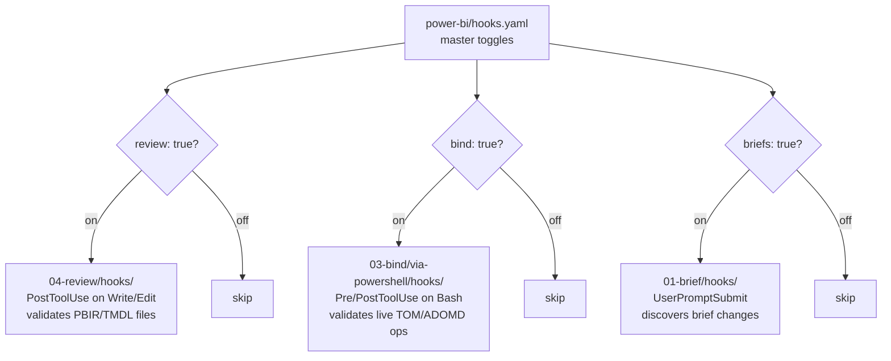

# How this workspace works

> A walkthrough for explaining the system to teammates. Read [README.md](README.md) first for the 30-second version.

## What it is

A set of **folder-as-app blueprints** for specific tools (currently Power BI). Each blueprint is markdown + folder structure + tiny scripts. No custom agents, no plugins, no skill bundles. Claude reads the folders to learn what to do.

## The PDF reference (3-Layer Folder Architecture)

Source: [Stop Building AI Agents. Use This Folder System Instead](https://www.youtube.com/watch?v=MkN-ss2Nl10) → bundled PDF at [power-bi/_examples/AI_Folder_Architecture.pdf](power-bi/_examples/AI_Folder_Architecture.pdf).

### The core idea

Most "AI agents" load a giant `SKILL.md` (10-25 KB) into context every time the skill activates. The PDF argues this is wasteful — most of that knowledge is irrelevant to the specific task at hand. Replace the agent/skill with a **folder structure** Claude navigates:

| Layer | Role | Loads when | Size |
|---|---|---|---|
| **L1 — Map** | A `CLAUDE.md` at the workspace root that routes user intent to the right room | Always (session start) | 3-15 KB |
| **L2 — Rooms** | Numbered topical folders (`01-brief/`, `02-build/`, …) each with a `context.md` describing scope + workflow | When user enters that room's domain | 1-3 KB per room |
| **L3 — Atomic files** | One markdown per task, ≤80 lines, ≤2 KB. Holds the exact procedure for one operation | Only when that specific task runs | 0.5-3 KB per file |

### Core principles

1. **The folder IS the app.** No code, no agents. Markdown + structure carries the knowledge.
2. **One concern per file.** A file says how to "rename a page" or "add a KPI" — not both.
3. **Surgical loading.** Loading 3 atoms (~6 KB) is cheaper than loading one SKILL.md (~15 KB) on every task.
4. **Workflow over agent.** Numbered rooms imply pipeline order: brief → build → bind → review.
5. **File names are the index.** No database, no vector store. The directory tree IS the lookup.

### Why this matters in $ terms

Plugin/skill bundles auto-load their full SKILL.md whenever activated. Across 5 mixed-domain tasks in one session, that's ~100 KB of knowledge in context. Atomic loading runs the same 5 tasks on ~48 KB. At Sonnet 4 input rates ($3/M tokens), and accounting for context accumulation across tool calls, the atomic approach typically runs **~50% cheaper per session**.

---

## The architecture as applied here

```text
Workspace-Blueprint/
├── CLAUDE.md                    ← L1 router (workspace-level — which blueprint?)
├── README.md                    ← human intro
├── HOW-IT-WORKS.md              ← this file
├── .claude/settings.json        ← Claude Code hook registrations
└── power-bi/                    ← ONE blueprint (others would sit alongside)
    ├── CLAUDE.md                ← L1 router (blueprint-level — which room?)
    ├── hooks.yaml               ← master toggles for all hook subsystems
    ├── 01-brief/                ← L2 room — intake / requirements
    │   ├── context.md
    │   ├── brief-template.md
    │   ├── hooks/discover-briefs.sh
    │   └── …
    ├── 02-build/                ← L2 room — author reports, models, themes, visuals
    │   ├── report/, model/, theme/, visuals/
    │   └── …
    ├── 03-bind/                 ← L2 room — live model ops (MCP or PowerShell/TOM)
    ├── 04-review/               ← L2 room — validate, audit, lineage
    ├── projects/                ← raw layer (the actual PBIP work)
    │   ├── <project-name>/      ← thick PBIP project
    │   └── themes/<slug>/       ← theme library (separate lifecycle)
    ├── outputs/                 ← dated artifacts (YYYY-MM-DD-<project>-<type>.<ext>)
    └── _examples/               ← provenance snapshot (do not load unless asked)
```

Today: **438 atomic .md files** across the rooms, mean **1.87 KB** per file.

---

## Workflows visualized

### 1 — Intent routing

How a user request becomes the right files loaded.



The L1 router holds the **routing table** (intent → atom path). Claude follows that table; it does not browse the filesystem looking for relevant files.

### 2 — Brief-first execution (file before chat)

The blueprint reads project briefs from disk BEFORE asking discovery questions. Briefs persist; chat doesn't.



The brief acts as the **contract**: comprehensive brief = zero discovery questions. Same pattern applies to themes (`projects/themes/<slug>/brief.md`).

### 3 — Auto-discovery of brief changes

A small hook script makes Claude notice when you create or edit a brief in your IDE between turns.



Toggle via `power-bi/hooks.yaml` → `briefs: false`. Registered in `.claude/settings.json`.

### 4 — 3-tier live-model preference

When Claude needs to read or change the actual model (not the on-disk TMDL), it tries cheap-and-local first, expensive-and-remote last.



- **Tier 1** wins for "what measures exist?" on a thick PBIP — no connection, no cost.
- **Tier 2** wins for live mutations + DAX queries when the MCP is wired up.
- **Tier 3** wins for things MCP rarely exposes (field parameters, query traces, daxlib package mgmt, VertiPaq stats).

### 5 — Theme creation workflow

The atomic 7-step workflow for authoring a theme from scratch.



Each step is one atomic file under `power-bi/02-build/theme/create/`. Claude reads them in order — only loading the ones for steps actually in progress.

### 6 — Hook subsystems (3 of them)

Hooks are optional accelerators. Each subsystem has its own toggle in `power-bi/hooks.yaml`.



Flip any to `false` for fast iteration; the blueprint's CLAUDE.md routing alone still works without them.

---

## Atomic vs plugin/skill — visual comparison

Same 5-task session, different loading strategy:

```text
Plugin / skill model                  Atomic blueprint model
─────────────────────                  ──────────────────────
                                                              
 Task 1: "rename a page"                Task 1: "rename a page"
   loads pbip/SKILL.md       ~12 KB      loads 1 atom            ~1 KB
                                                                    
 Task 2: "create a theme"               Task 2: "create a theme"
   loads modifying-theme/    ~17 KB      loads 7 atoms          ~10 KB
   + reference files         ~11 KB                                 
                                                                    
 Task 3: "add a measure"                Task 3: "add a measure"
   loads tmdl/SKILL.md        ~9 KB      loads 2 atoms           ~3 KB
                                                                    
 Task 4: "validate report"              Task 4: "validate report"
   loads pbir-cli/SKILL.md   ~23 KB      loads 1 atom            ~1 KB
                                                                    
 Task 5: "audit perf"                   Task 5: "audit perf"
   loads dax/SKILL.md         ~2 KB      loads 4 atoms           ~6 KB
   + references               ~8 KB                                 
                                                                    
─────────────────────                  ──────────────────────
Knowledge in context ~82 KB             Knowledge in context ~21 KB
                                        + L1 router (once)     +13 KB
                                        Total                  ~34 KB
                                                                
~50% cheaper per session, more headroom for the actual work
```

Numbers from real file-size measurements in this workspace, March 2026.

---

## How to explain it to someone in 60 seconds

> "Instead of building an AI agent with a big skill file, we use a folder structure that Claude reads. The folder is the app. A top-level `CLAUDE.md` routes the user's intent to a numbered room (`01-brief/`, `02-build/`, etc.). Each room has a `context.md` describing its scope and an index of tiny markdown files (one task per file, under 2 KB). Claude loads only the atoms it needs for the current step — typically 3-5 files, 10 KB total. Compared to plugin/skill bundles that load 15-25 KB per activation, this runs about 50% cheaper per session and is much easier to maintain — open the folder and you can read the agent's entire 'memory'."

## How to extend it

To add a new blueprint for a different tool (Tableau, dbt, Fabric Notebooks, etc.):

1. Create `<tool-name>/` at the workspace root (kebab-case)
2. Add `<tool-name>/CLAUDE.md` — L1 router for that blueprint
3. Add `<tool-name>/README.md` — human intro
4. Add numbered rooms (`01-…`, `02-…`) each with `context.md` + atomic files
5. Add `projects/`, `outputs/`, `_examples/` to the same shape
6. Update root [CLAUDE.md](CLAUDE.md) "Available blueprints" section

Same structure, different domain. The workspace router (`E:/Workspace-Blueprint/CLAUDE.md`) routes between blueprints; each blueprint routes within itself.

## What this is NOT

- Not an agent. Claude has no custom persona or system prompt — just a folder it reads.
- Not a plugin. No `.claude-plugin/` manifest, no marketplace.
- Not a skill. No `SKILL.md` with frontmatter activation triggers.
- Not a vector DB. The directory tree IS the index.

It's a knowledge layout pattern that makes Claude faster, cheaper, and easier to audit when working in a specific domain.

## See also

- [CLAUDE.md](CLAUDE.md) — the workspace-level L1 router
- [power-bi/CLAUDE.md](power-bi/CLAUDE.md) — the Power BI blueprint's L1 router
- [power-bi/_examples/AI_Folder_Architecture.pdf](power-bi/_examples/AI_Folder_Architecture.pdf) — the original PDF reference
- [Stop Building AI Agents. Use This Folder System Instead](https://www.youtube.com/watch?v=MkN-ss2Nl10) — source video
